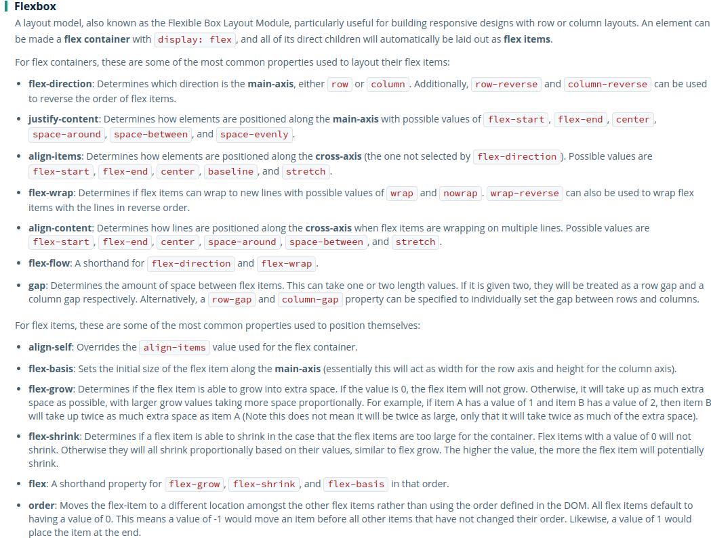
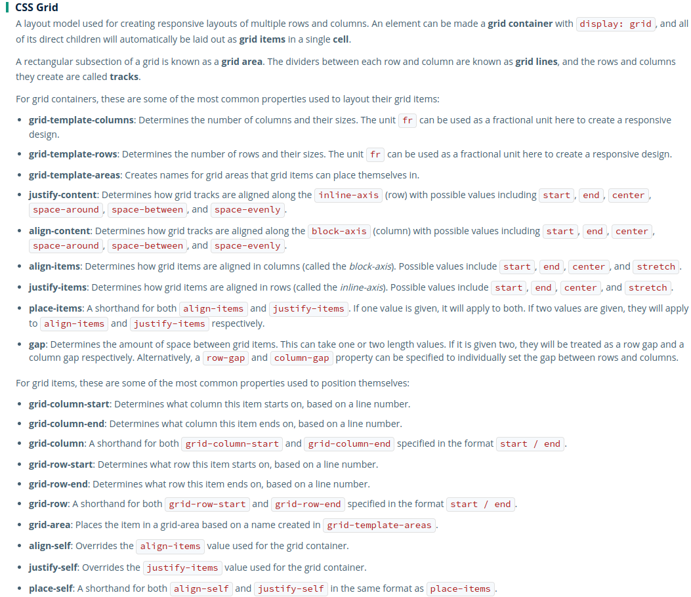

# Cascading Style Sheets (CSS)

## Cascading Order
1. User Agent Stylesheets (Browser default styles)
2. User Stylesheets (User Preferences saved in the browser)
3. Author Stylesheets (Developer written)

## Selectors
1. Type Selector
2. Class Selector
3. ID selector
4. Attribute Selector: select all elements with specific HTML attribute e.g. [type="submit"]
- [href*="algoexpert.io"]: select all elements with href attribute with text at any location
- [href$="algoexpert.io"]: select all elements with href attribute with text at the end of the value
- [href^="algoexpert.io"]: select all element with href attribute with text at the beginning of the value

## Combinators
1. Descendent combinator: **selector1 selector2**  selects all selector2 elements who are direct child of selector1
2. Child Combinator: **selector1 > selector2** selects all children with selector2 attribute in selector1 parent
3. Sibling Combinator: **selector1~selector2** selects all elements of selector2 which are siblings of selector1 and must come after them
4. Adjacent sibling combinator: **selector1+selector2** selects elements of selector2 which are siblings and come just after selector1

## Psuedo (selecting element on the current state of the element)
1. [Pseudo Class](https://developer.mozilla.org/en-US/docs/Web/CSS/Pseudo-classes) 
  - button:hover
  - a:link
  - a:visited
  - input:focus
  - input:invalidated:not(:focus) 
2. [Pseudo Element](https://developer.mozilla.org/en-US/docs/Web/CSS/Pseudo-elements) - selecting specific portion of the element)
  - ::first-letter
  - ::before
  - ::after

## Selector Specificity
1. Inline Styles: 1000
2. ID: 100
3. Classes: 10
4. Pseudo-Classes: 10
5. Attributes: 10
6. Elements: 1
7. Pseudo-Elements: 1

## CSS Units
  - px: pixels, absolute length
  - em: relative to font size of parent
  - rem: relative to root element font size (Best to use in the practice)
  - vw: 1% of the viewport width
  - vh: 1% of the viewport height
  - ch: width of "0" character (How many chars in a paragraph)
  - %: relative to parent value (For width)

## Box Model
  - padding
  - margin
  - border

## Box Sizing
Best way to resolve conflicts of boundaries. Mentioned in universal selector
  - border-box
  - content-box 

## Position
   - static
   - fixed
   - relative
   - sticky (between relative and fixed)
   - absolute (similar to fixed except positioned relative to doc)

## [Stacking Context](https://developer.mozilla.org/en-US/docs/Web/CSS/CSS_Positioning/Understanding_z_index/The_stacking_context)
  - Stacking context in a position with z-axis  

## [Flex](https://developer.mozilla.org/en-US/docs/Web/CSS/CSS_Flexible_Box_Layout)
1. display
2. flex-direction
3. flex-wrap
4. flex-flow: direction + wrap
5. justify-content: elements positioned on main-axis (X-axis)
6. align-items: elements positioned on cross-axis (Y-axis)
7. align-content
8. gap: Gap between each element

#### Flex-Items
1. align-self: override align-items
2. flex-basis: size along main-axis (width for row, height for column)
3. flex-grow: grow item into extra space
4. flex-shrink: item to shrink in case items too large for container
5. flex: flex-grow + flex-shrink + flex-basis
6. order

## [Grid](https://developer.mozilla.org/en-US/docs/Web/CSS/CSS_Grid_Layout)
1. grid-template-columns: number of columns and their sizes
2. grid-template-rows: number of rows and their sizes
3. grid-template-areas: name grid areas
4. justify-content: aligned along inline-axis
5. align-content: aligned along block-axis
6. align-items: aligned items in columns
7. justify-items: aligned items in rows
8. place-items: align-items + justify-items
9. gap

#### Grid Items
1. grid-column-start
2. grid-column-end
3. grid-column: grid-column-start / grid-column-end
4. grid-row-start
5. grid-row-end
6. grid-row: grid-row-start / grid-row-end
7. grid-area: name of the area defined in grid-template-areas
8. align-self: overrides align-items
9. justify-self: overrides justify-items
10. place-self: align-self + justify-self

